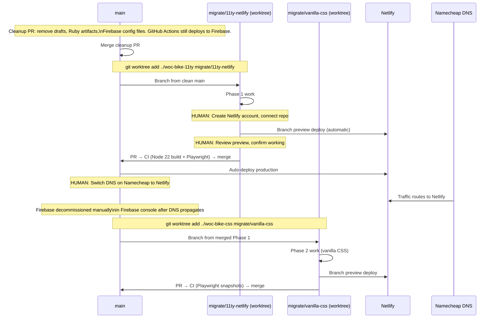
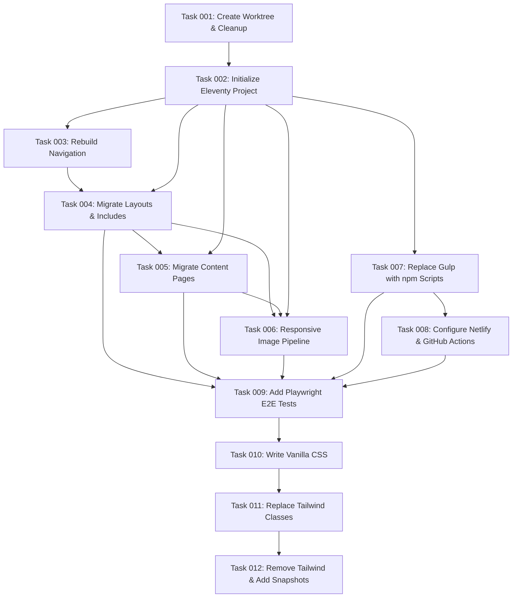

# Plan: Jekyll → Eleventy Migration — Vanilla CSS, Netlify Hosting, Playwright Tests

## Original Work Order
> Plan a migration of this static site to 11ty, change CSS to vanilla, eliminate dependencies on gulp, browser-sync, tailwind, add Playwright testing. Transfer hosting from Firebase to Netlify (free plan). Keep everything free (zero cost). Note steps requiring human intervention (Netlify account setup, DNS switch on Namecheap). Consider what can reasonably be done after the site is on Netlify. Retain the Google Sheets contact form backend.

## Plan Clarifications

| Question | Answer |
|----------|--------|
| New project or migrate existing codebase? | **Migrate the existing repo.** Git history, content, and GitHub secrets are preserved. Most Jekyll Liquid syntax transfers directly; targeted rewrites handle incompatibilities. |
| Tailwind removal: simultaneously with 11ty migration or separately? | **Separately (Phase 2).** The 11ty migration is already high-risk. Keeping Tailwind in Phase 1 via a standalone PostCSS build step allows each phase to be tested and merged independently. |
| Netlify Forms vs Google Sheets for the contact form? | **Keep Google Sheets backend.** No form backend migration planned. |
| Netlify deployment: native GitHub integration or GitHub Actions deploy? | **Netlify native GitHub integration.** Netlify auto-deploys on push to `main` and creates branch preview deploys. No custom deploy step in GitHub Actions is needed. |
| reCAPTCHA version? | **v2 checkbox widget.** `g-recaptcha` div with `data-sitekey` confirmed in `30-contact.html`. The token is explicitly stripped before the Google Sheets POST (`key !== "g-recaptcha-response"`) — client-side friction only, no server-side verification. |
| Node.js version? | **Node 22 (current LTS).** `.nvmrc` updated from `20` to `22`. All dependencies (Eleventy v3, eleventy-img, Playwright, Tailwind v4) support Node 22 without issue. Node 22 is LTS until April 2027. |

## Executive Summary

This migration proceeds through three sequential phases, each merged to `main` as a separate pull request, with the current site fully operational throughout:

**Pre-migration cleanup** — Remove orphaned and legacy files from `main` before any migration work begins. Reduces Phase 1 diff size and eliminates Jekyll/Firebase artifacts that would otherwise need to be tracked across branches. Note: Firebase *hosting* files are removed here, but the GitHub Actions *deploy step* remains active until Phase 1 is merged.

**Phase 1 — Eleventy migration** — Jekyll → Eleventy, Gulp/Browsersync → npm scripts + PostCSS, Firebase Hosting → Netlify, Node 20 → Node 22. Tailwind is retained via a standalone PostCSS step. The Google Sheets contact form backend and reCAPTCHA v2 are unchanged. Playwright end-to-end tests are added as a migration safety net. Two human-intervention steps are required: creating the Netlify account and connecting the GitHub repo (before merge), and switching DNS on Namecheap (after the production Netlify deploy is confirmed).

**Phase 2 — Vanilla CSS** — Tailwind CSS replaced with handwritten vanilla CSS using custom properties. PostCSS and all Tailwind dependencies are removed. Playwright tests extended with visual snapshot regression coverage.

All infrastructure costs remain at zero. All migration work uses git worktrees on dedicated branches, so `main` is always deployable and rollback is always possible.

## Context

### Current State vs Target State

| Aspect | Current State | Target State | Why |
|--------|--------------|--------------|-----|
| Site generator | Jekyll (Ruby / Bundler) | Eleventy 11ty (Node.js) | Eliminate Ruby; single Node.js runtime |
| Build tool | Gulp 5 + Babel transpilation | Native `npm` scripts + PostCSS (Phase 1); npm scripts only (Phase 2) | Remove unnecessary orchestration |
| CSS framework | Tailwind CSS v4.1.13 + PostCSS | Tailwind retained in Phase 1; replaced with vanilla CSS in Phase 2 | Phased approach keeps risk per PR manageable |
| Dev server | Browsersync (via Gulp) | Eleventy built-in dev server (`--serve`) | Included in 11ty; zero extra dependency |
| Template language | Jekyll Liquid (Ruby gem) | Eleventy Liquid (`liquidjs`) | Compatible for most templates; navigation requires a targeted rewrite |
| Navigation data | `site.pages` with Jekyll-only `where_exp` filter | Static `_data/nav.js` file | `where_exp` is not in `liquidjs`; static nav data is simpler and more maintainable |
| Responsive images | `jekyll-responsive-image` + ImageMagick (build-time, Ruby) | `@11ty/eleventy-img` shortcode (build-time, Node) | Eliminates Ruby/ImageMagick; same output, Node-only pipeline |
| JS pipeline | Gulp + Terser | Eleventy passthrough copy; optional `esbuild --minify` for production | One JS file; no bundler needed |
| Contact form backend | Google Apps Script → Google Sheets | **Unchanged** | No form migration planned |
| reCAPTCHA | v2 checkbox widget | **Unchanged** | Retained as client-side spam friction |
| Hosting | Firebase Hosting | Netlify (free plan) | Simpler deploys, branch previews, no Ruby in CI |
| CI/CD | GitHub Actions: Ruby + Node, builds + deploys to Firebase | GitHub Actions: Node 22 only, build + Playwright; Netlify deploys via GitHub integration | Faster CI; no Ruby setup |
| Testing | None | Playwright end-to-end (Phase 1) + visual snapshots (Phase 2) | Migration regression safety net; permanent CI suite |
| Node.js version | 20 (`.nvmrc`) | 22 (current LTS) | Node 22 is LTS until April 2027; all dependencies support it |

### Background

**Why migrate the existing codebase?** The content is the valuable asset — HTML, Markdown, includes, data files, images. Most of it transfers. A new repository would sever git history and require re-configuring GitHub repository secrets.

**Navigation: the critical Liquid incompatibility.** Both `_includes/nav-lg.html` and `_includes/nav-mobile.html` use `site.pages | sort:"name" | where_exp:"item","item.exclude != true" | where_exp:"item","item.title != nil"`. The `where_exp` filter is Jekyll-specific and unavailable in Eleventy's `liquidjs`. The fix is a static `_data/nav.js` that defines the five navigation items explicitly. Templates iterate over `nav` instead of `site.pages`. This is also more maintainable — adding or reordering nav items doesn't require changing template logic.

**Responsive images: `@11ty/eleventy-img`.** The `` Liquid tag in `15-programs.md` is registered by the Jekyll plugin and unavailable in Eleventy. Replaced by an `@11ty/eleventy-img` shortcode (e.g., ``). The shortcode generates the same `<picture>` element with WebP sources and multiple sizes at build time — no ImageMagick or Ruby required. `_includes/responsive-image.html` is deleted; the shortcode handles output. `src/js/utils/convert-to-webp.js` is retained as a standalone utility but is no longer part of the build pipeline.

**reCAPTCHA v2.** The checkbox widget is retained as-is. The token is stripped before the Google Sheets POST — there is no server-side verification. Without reCAPTCHA, only the honeypot field protects the form. Removing it is out of scope and would make the spam protection thinner.

**`_config_development.yml`:** Contains Firebase API keys for local dev overrides. This file is removed in the pre-migration cleanup. Local development after migration does not require Firebase config (Firebase SDK is also removed). The `WEBHOOK_URL` for local form testing can be set via a `.env` file (gitignored).

**`.txt` LLM-readable mirrors** (`about.txt`, `contact.txt`, `how-can-i-help.txt`, `index.txt`, `programs.txt`, `llms.txt`): These are intentional (the recent commit "use txt extension for LLMs.txt" confirms this). They are preserved and migrate to Eleventy as Liquid templates with `layout: none` front matter — identical to the Jekyll pattern.

## Architectural Approach

```mermaid
graph TD
    subgraph "Pre-Migration Cleanup (PR on main)"
        C1[Remove hidden drafts:\n.07-re-homing-project.md\n.25-calendar.html]
        C2[Remove Ruby artifacts:\nGemfile, Gemfile.lock, .ruby-version\n.jekyll-cache, .jekyll-metadata\n.babelrc]
        C3[Remove Firebase config files:\nfirebase.json, .firebaserc, .firebase/\n_data/firebase_config.yml\n_includes/firebase-init.html\n_config_development.yml]
        C4[GitHub Actions deploy step\nNOT changed yet]
    end

    subgraph "Phase 1: migrate/11ty-netlify"
        P1A[.eleventy.js config\n+ npm scripts\nNode 22]
        P1B[Template migration:\nlayouts, includes, front matter]
        P1C[nav rebuilt via _data/nav.js]
        P1D[@11ty/eleventy-img shortcode\nreplaces responsive_image tag]
        P1E[Tailwind retained\nvia postcss npm script]
        P1F[netlify.toml\nUpdate GitHub Actions:\nNode 22, remove Ruby + Firebase deploy\nadd Playwright step]
        P1G[Playwright tests]
    end

    subgraph "Human Steps"
        H1[Create Netlify account\nConnect GitHub repo]
        H2[Merge Phase 1 PR\nVerify Netlify preview deploy]
        H3[Switch DNS on Namecheap]
    end

    subgraph "Phase 2: migrate/vanilla-css"
        P2A[Write vanilla CSS\nCSS custom properties]
        P2B[Replace Tailwind classes\nin all templates]
        P2C[Remove Tailwind + PostCSS deps\ntailwind.config.js + src/stylev3.css]
        P2D[Extend Playwright tests:\nvisual snapshot comparisons]
    end

    C1 & C2 & C3 --> P1A
    P1A --> P1B & P1C & P1D
    P1B & P1C & P1D --> P1E --> P1F --> P1G
    H1 --> P1F
    P1G --> H2 --> H3
    H3 --> P2A --> P2B --> P2C --> P2D
```

### Sequencing and Rollback



**Rollback options:**
- Phase 1 blocked: `git worktree remove` + `git branch -D`. Main continues on Jekyll + Firebase.
- Phase 2 blocked: Site is live on Netlify with Tailwind. Phase 2 can be deferred indefinitely.
- Post-DNS issues: Revert Namecheap DNS to previous values. Firebase Hosting remains active until explicitly deleted.

### Pre-Migration Cleanup

**Objective**: Remove orphaned, legacy, and unreachable files from `main` before the migration branch is created. Keeps the migration diff focused on actual migration work.

| File / Directory | Reason for Removal |
|-----------------|-------------------|
| `.07-re-homing-project.md` | Hidden draft; not published |
| `.25-calendar.html` | Hidden draft; not published |
| `.jekyll-cache/` | Jekyll build artifact |
| `.jekyll-metadata` | Jekyll incremental build index |
| `.babelrc` | Babel config for Gulp; removed with Gulp in Phase 1 — remove early |
| `.ruby-version` | Ruby version pin |
| `Gemfile` + `Gemfile.lock` | Ruby dependencies |
| `firebase.json` | Firebase Hosting config; replaced by `netlify.toml` in Phase 1 |
| `.firebaserc` | Firebase project reference |
| `.firebase/` | Firebase CLI cache |
| `_data/firebase_config.yml` | Firebase API keys; Firebase SDK removed |
| `_includes/firebase-init.html` | Firebase SDK init script |
| `_config_development.yml` | Firebase local dev overrides |

**Not removed in cleanup:** `gulpfile.babel.js` and `tailwind.config.js` stay until Phase 1 removes them (the GitHub Actions workflow still references the Gulp build command; removing Gulp before Phase 1 would break CI).

**Important:** The GitHub Actions `firebase-deploy.yml` workflow is **not changed** in the cleanup PR. It still deploys to Firebase until the Phase 1 PR updates it.

### Phase 1 — Eleventy Setup

**Objective**: Configure Eleventy to replicate Jekyll's directory conventions and output structure.

`.eleventy.js` at project root:
- Input: `.` (project root), matching Jekyll
- Output: `_site`, matching Jekyll; Netlify `publish = "_site"` is unchanged
- Template formats: `liquid`, `html`, `md`
- Layout aliases: `{ "default": "layouts/default.html", "markdown-content": "layouts/markdown-content.html" }` so front matter `layout: default` continues to work
- Passthrough copies: `assets/` → `_site/assets/`, `src/js/navigation.js` → `_site/assets/js/navigation.js`
- Watch targets: `src/stylev3.css` (triggers rebuild when CSS source changes)
- Image shortcode: `@11ty/eleventy-img` registered as ``

`.nvmrc` updated from `20` to `22`.

Jekyll's `_config.yml` site variables (`title`, `description`, `phone`, `hours`, `email`, `author`) move to `_data/site.js`. Eleventy auto-loads `_data/` and makes values available as `{{ site.title }}` in Liquid templates.

Existing `_data/*.yml` files (`testimonials.yml`, `images.yml`, `videos.yml`, `webhook_config.yml`) are auto-loaded by Eleventy's native YAML data support (Eleventy v3).

Layouts move from `_layouts/` to `_includes/layouts/`. Aliases in `.eleventy.js` preserve existing `layout: default` front matter without changes to content files.

`.eleventyignore` excludes: `node_modules/`, `_site/`, `.git/`, `src/stylev3.css` (processed separately), `src/js/utils/`.

### Phase 1 — Template Migration

**Objective**: Convert Jekyll-specific template syntax to Eleventy-compatible Liquid.

**No changes needed** (identical syntax): ``, ``, ``, ``, `{{ page.title }}`, `{{ content }}`, front matter `layout`, `permalink`, `published`.

**Navigation** (`nav-lg.html`, `nav-mobile.html`): Replace `site.pages | sort:"name" | where_exp` with iteration over `{{ nav }}` from a new `_data/nav.js` file. The file defines the five pages with their titles and URLs, ordered as they should appear. The nav template logic simplifies to a straightforward `` loop.

**Responsive images**: Remove `` Liquid tag. Replace with the `@11ty/eleventy-img` shortcode (syntax defined in `.eleventy.js` config, e.g., ``). Delete `_includes/responsive-image.html`.

**SEO plugin** (``): Replace with explicit `<meta>` tags in `_includes/head.html` — title, description, canonical URL, Open Graph. A small, known set; no dynamic discovery needed.

**RSS feed** (``): Replace with a manual `<link rel="alternate">` tag in head. Generate `/feed.xml` using `@11ty/eleventy-plugin-rss`, preserving the existing feed URL.

**Data references**: `site.data.webhook_config.webhook_url` → `webhook_config.webhook_url`; `site.data.testimonials` → `testimonials`. The inline webhook URL script in `30-contact.html` uses `{{ webhook_config.webhook_url }}` (Eleventy's flattened data path).

### Phase 1 — Responsive Images

**Objective**: Replace `jekyll-responsive-image` + ImageMagick with `@11ty/eleventy-img`.

`@11ty/eleventy-img` generates multiple image sizes and WebP variants in Node at build time. Registered as a Nunjucks/Liquid shortcode in `.eleventy.js`. The shortcode is called in place of the Jekyll `` tag — currently used twice in `15-programs.md`.

Output configuration mirrors the current `jekyll-responsive-image` setup: six widths (300, 400, 600, 800, 975, 1600px), WebP + original format, lazy loading, `async` decoding, output path `assets/img/{width}/{basename}`.

CI impact: GitHub Actions no longer needs `sudo apt-get install imagemagick libmagickwand-dev` or any Ruby setup.

`src/js/utils/convert-to-webp.js` is retained but documented as a standalone utility (not part of the build pipeline post-migration).

### Phase 1 — Build Pipeline

**Objective**: Replace Gulp with npm scripts; retain Tailwind via a standalone PostCSS step.

`gulpfile.babel.js` is deleted. `package.json` scripts replace all Gulp tasks:

- `"build:css"`: runs `postcss src/stylev3.css -o _site/assets/css/stylev3.css`
- `"build:js:prod"`: runs `esbuild src/js/navigation.js --minify --outdir=_site/assets/js/` (or passthrough copy in dev)
- `"build:production"`: runs `npm run build:css && eleventy`
- `"dev"`: runs `concurrently "postcss src/stylev3.css -o _site/assets/css/stylev3.css --watch" "eleventy --serve"` (CSS watch + Eleventy dev server in parallel)

`tailwind.config.js` content paths are updated for Eleventy's layout location (`_includes/layouts/` instead of `_layouts/`).

**Removed from `package.json`:** `gulp`, `gulp-postcss`, `gulp-sourcemaps`, `gulp-terser`, `browser-sync`, `@babel/preset-env`, `@babel/register`, `cross-spawn`. Added: `concurrently` (dev convenience), `esbuild` (optional JS minification).

### Phase 1 — Netlify Configuration and CI Update

**Objective**: Configure Netlify hosting; simplify GitHub Actions to Node 22 + Playwright.

`netlify.toml` at project root:

```toml
[build]
  command = "npm run build:production"
  publish = "_site"

[build.environment]
  NODE_VERSION = "22"
```

`firebase-deploy.yml` is renamed `ci.yml` and updated:
- **Remove**: Ruby setup, Bundler, ImageMagick, Firebase CLI, Firebase deploy action, `FIREBASE_*` references
- **Update**: Node.js version to 22
- **Retain**: `npm ci`, webhook config injection (generates `_data/webhook_config.yml` from `WEBHOOK_URL` secret — still needed)
- **Add**: `npm test` (Playwright, headless Chromium on `ubuntu-latest`)

**Human intervention steps:**

1. Create a Netlify account at netlify.com (free plan). Connect the GitHub repository via "New site from Git". Netlify reads `netlify.toml` and begins deploying branches automatically — including the migration branch preview.
2. Review the migration branch preview deploy on Netlify before opening the PR. Verify all pages, navigation, images, and contact form.
3. Merge the Phase 1 PR. Netlify auto-deploys `main`.
4. Switch DNS on Namecheap: update the domain to point to Netlify (Netlify dashboard provides the exact A record or CNAME values). Netlify auto-provisions SSL via Let's Encrypt.
5. After confirming production traffic on Netlify (DNS fully propagated), decommission Firebase Hosting via the Firebase console — no code change needed, since Firebase config files were removed in the cleanup PR.

### Phase 1 — Playwright Tests

**Objective**: Add end-to-end tests as a migration regression safety net and permanent CI fixture.

`playwright.config.js` at project root:
- Base URL: `http://localhost:8080` (Eleventy dev server)
- Test directory: `tests/e2e/`
- Browser: Chromium (CI); all three browsers optionally locally
- `webServer`: auto-starts `npm run dev` before test run
- Screenshots on failure

Test coverage:
- **Page load**: All pages return HTTP 200; correct `<title>`; no `` 404s
- **Navigation**: Desktop nav links render; mobile menu toggle opens/closes; all links resolve
- **Contact form**: Required field validation (name, email, message); honeypot hidden; reCAPTCHA div present; submit button present
- **Kickstand Club progress bar**: Element present; computed width ~87.5%; ARIA label present
- **Donate section**: PayPal embed and Venmo link present on homepage
- **Homepage sections**: Stories, donation, testimonials render

### Phase 2 — Vanilla CSS

**Objective**: Replace all Tailwind utility classes with handwritten vanilla CSS using custom properties, then remove Tailwind and PostCSS entirely.

`src/style.css` (replaces `src/stylev3.css`):
1. `:root` custom properties — all design tokens from `src/stylev3.css`'s `@theme` block translated 1:1: `--color-teal-500: #25A2AA`, `--spacing-8: 36px`, `--font-sans: "Avenir Next", Helvetica, Arial, sans-serif`
2. Minimal CSS reset / base styles (replacing `@tailwindcss/forms` and `@tailwindcss/typography` resets)
3. Component styles: `.nav`, `.nav-link`, `.btn`, `.btn-primary`, `.banner`, `.section`, `.card`, `.form-field`, `.footer`, `.progress-bar`, `.donate`, `.testimonial`, `.prose`
4. Responsive breakpoints: `@media (min-width: 640px)`, `(min-width: 768px)`, `(min-width: 1024px)`
5. Social icon hover rules (three rules, already plain CSS — transferred unchanged)

**Conversion process**: Grep all `class="..."` attributes across HTML files for the full Tailwind class inventory. Map class groups to semantic rules. Replace inline utility classes in templates with semantic class names.

**Eleventy passthrough** replaces the PostCSS step: `addPassthroughCopy("src/style.css")` in `.eleventy.js`. Optional: `lightningcss --minify` in `build:production` for CSS minification.

**Removed in Phase 2**: `tailwindcss`, `@tailwindcss/postcss`, `@tailwindcss/forms`, `@tailwindcss/typography`, `prettier-plugin-tailwindcss`, `postcss`, `concurrently` (no longer needed without CSS watch step), `tailwind.config.js`, `src/stylev3.css`.

**Updated `package.json` scripts** (Phase 2 final state):
- `"dev"`: `eleventy --serve` (CSS is passthrough; no separate watch needed)
- `"build:production"`: `eleventy` (or `lightningcss src/style.css --minify --bundle -o _site/assets/css/style.css && eleventy`)

**Playwright Phase 2 additions**: Visual snapshot comparisons for each page at 375px (mobile) and 1280px (desktop). First run generates baseline snapshots committed to the repo; subsequent CI runs catch deviations.

## Risk Considerations and Mitigation Strategies

<details>
<summary>Technical Risks</summary>

- **`liquidjs` filter gaps**: `where_exp` is used in both nav templates and is not in `liquidjs`. Other Jekyll-specific filters may also surface.
    - **Mitigation**: Navigation is rebuilt with static `_data/nav.js` — eliminates the filter dependency entirely. Audit all templates for other Jekyll-specific filter usage before starting Phase 1. Register custom Liquid filters in `.eleventy.js` for any remaining gaps.

- **`@11ty/eleventy-img` output path differences**: Generated image paths may differ from `jekyll-responsive-image`'s output, breaking `` references.
    - **Mitigation**: Configure `@11ty/eleventy-img` to output to the same path structure. Playwright image tests catch broken paths.

- **`jekyll-seo-tag` and `jekyll-feed` replacement**: Plugins auto-generate SEO meta and RSS.
    - **Mitigation**: SEO meta is a small, known tag set — replicate in `_includes/head.html`. RSS: `@11ty/eleventy-plugin-rss` generates `/feed.xml` at the same URL.

- **Tailwind class inventory for Phase 2**: Must identify all classes before writing vanilla CSS.
    - **Mitigation**: Comprehensive grep across all HTML files before Phase 2. Design tokens are fully documented in `src/stylev3.css` — CSS variable set is well-defined.

</details>

<details>
<summary>Implementation Risks</summary>

- **Visual regression in Phase 2**: Subtle layout differences possible when moving from utility classes to semantic CSS.
    - **Mitigation**: Playwright snapshot baselines generated from the Phase 1 production site. Phase 2 run catches deviations. Manual review at mobile and desktop breakpoints before PR opens.

- **Webhook secret injection**: The `webhook_config.yml` injection step in GitHub Actions must remain active throughout Phase 1 and Phase 2. The form still uses Google Sheets.
    - **Mitigation**: Documented as "do not remove" in the CI workflow file. Removed only if a form backend migration is planned in the future.

- **DNS transition window**: Some traffic hits Firebase, some Netlify, during propagation.
    - **Mitigation**: Firebase Hosting stays active (not decommissioned in code — only via Firebase console) until propagation completes. Both serve identical content.

- **reCAPTCHA with no server-side verification**: The v2 token is stripped before the Google Sheets POST. Without reCAPTCHA, only the honeypot remains.
    - **Mitigation**: reCAPTCHA v2 is retained as-is. Adding server-side token verification in the Apps Script is a separate future decision, out of scope for this migration.

- **Branch divergence**: If `main` content changes during migration, they must be applied to the worktree branch.
    - **Mitigation**: Keep migration branches short-lived. Cherry-pick urgent `main` changes into the worktree.

</details>

## Success Criteria

### Pre-Migration Cleanup
1. All listed legacy/orphaned files removed from `main`
2. Site still deploys to Firebase from `main` after cleanup (Gemfile and Gulp are retained until Phase 1; only Firebase config and hidden drafts are removed)

### Phase 1
1. `npm run build:production` completes with Node 22, no Ruby, no Bundler, no ImageMagick, no Gulp
2. All pages render visually identically to the pre-migration site
3. `npm run dev` starts Eleventy at `http://localhost:8080` with live reload
4. Responsive images generate correctly via `@11ty/eleventy-img`
5. Contact form: validation, honeypot, reCAPTCHA v2 widget, and Google Sheets submission functional
6. Navigation renders correctly on mobile and desktop (rebuilt via `_data/nav.js`)
7. Netlify production deploy live; DNS points to Netlify; SSL provisioned
8. Playwright suite passes in CI (headless Chromium, `ubuntu-latest`)
9. `package.json` contains no `gulp`, `browser-sync`, `@babel/*`, `cross-spawn`
10. `.nvmrc` contains `22`

### Phase 2
1. `package.json` contains no `tailwindcss`, `@tailwindcss/*`, `postcss`, `prettier-plugin-tailwindcss`
2. All pages render identically to Phase 1 (Playwright snapshot comparison passes)
3. CSS is a single file, passthrough-copied by Eleventy — no compilation step
4. `tailwind.config.js` and `src/stylev3.css` deleted

## Documentation

- `CLAUDE.md`: Update Tech Stack, Build Commands, Development Setup, Style Guidelines, Key Features, External Services sections; remove Jekyll/Ruby/Gulp/Tailwind/Firebase references; add Eleventy/Netlify/Playwright/vanilla CSS sections; note Node 22
- `README.md`: Update setup (`node --version`, `npm ci`, `npm run dev`) and build instructions; replace Firebase deploy docs with Netlify
- `.ai/task-manager/memory/`: Update project stack after migration completes

## Resource Requirements

### Development Skills
- Eleventy (11ty) configuration, data cascade, shortcodes, passthrough copies, layout aliases
- Liquid template syntax (Eleventy's `liquidjs` — mostly compatible with Jekyll Liquid)
- `@11ty/eleventy-img` for responsive image generation
- Vanilla CSS: custom properties, flexbox/grid, `@media` queries, responsive patterns
- Playwright test authoring (page tests + visual snapshots)
- Netlify configuration (`netlify.toml`, dashboard settings)
- Git worktrees

### Technical Infrastructure

**Phase 1 additions:**
- `@11ty/eleventy` v3
- `@11ty/eleventy-img`
- `@11ty/eleventy-plugin-rss`
- `@playwright/test`
- `concurrently` (CSS watch + 11ty serve in parallel)
- `esbuild` (optional, JS minification in production)

**Phase 1 removals:**
- `gulp`, `gulp-postcss`, `gulp-sourcemaps`, `gulp-terser`, `browser-sync`, `@babel/preset-env`, `@babel/register`, `cross-spawn`

**Phase 2 additional removals:**
- `tailwindcss`, `@tailwindcss/postcss`, `@tailwindcss/forms`, `@tailwindcss/typography`, `prettier-plugin-tailwindcss`, `postcss`, `concurrently`

**Phase 2 optional additions:**
- `lightningcss` (CSS minification without PostCSS)

## Notes

- The numeric filename prefixes on content files (`00-index.html`, `05-about.md`, etc.) are supported by Eleventy — `permalink` front matter overrides the resulting URL, identical to Jekyll.
- Eleventy does not require a `Gemfile`, `Gemfile.lock`, or any Ruby toolchain.
- The cleanup PR removes Firebase *configuration files* from the repo, but Firebase Hosting itself is decommissioned via the Firebase console — a manual step — only after DNS propagation is confirmed following the Phase 1 merge and DNS switch.
- `gulpfile.babel.js` and `tailwind.config.js` are NOT removed in the cleanup PR — they remain until Phase 1 (removing Gulp) and Phase 2 (removing Tailwind), respectively.

---

## Execution Blueprint

**Validation Gates:**
- Reference: `/config/hooks/POST_PHASE.md`

### Dependency Diagram



### Execution Phases

#### ✅ Phase 1: Migration Foundation
**Parallel Tasks:**
- ✔️ Task 001: Create migration worktree + remove orphaned files on branch (**main stays fully operational**)

#### ✅ Phase 2: Eleventy Bootstrap
**Parallel Tasks:**
- ✔️ Task 002: Initialize Eleventy Project (`.eleventy.js`, `package.json`, `.nvmrc`, `_data/site.js`)

#### ✅ Phase 3: Parallel Structural Work
**Parallel Tasks (both depend only on Task 002):**
- ✔️ Task 003: Rebuild Navigation with `_data/nav.js`
- ✔️ Task 007: Replace Gulp with PostCSS npm Scripts

#### ✅ Phase 4: Template Migration and Deployment Config
**Parallel Tasks:**
- ✔️ Task 004: Migrate Layouts and Includes (depends on 002, 003)
- ✔️ Task 008: Configure Netlify and Update GitHub Actions (depends on 007)

#### Phase 5: Content Pages
**Parallel Tasks:**
- Task 005: Migrate Content Pages (depends on 002, 004)

#### Phase 6: Responsive Images
**Parallel Tasks:**
- Task 006: Set Up Responsive Image Pipeline (depends on 002, 004, 005)

#### Phase 7: End-to-End Tests — Phase 1 PR Gate
**Parallel Tasks:**
- Task 009: Add Playwright E2E Tests (depends on 004, 005, 006, 007, 008)

> **Human Intervention Gate — before merging Phase 1 PR:**
> 1. Create Netlify account and connect GitHub repo to enable branch preview deploys
> 2. Open Phase 1 PR — review Netlify branch preview deploy for all pages
> 3. Confirm CI passes (Node 22 build + Playwright tests green)
> 4. Merge Phase 1 PR → `main` → Netlify auto-deploys production
> 5. Switch DNS on Namecheap to Netlify's provided values
> 6. After DNS propagation: decommission Firebase Hosting via Firebase console

#### Phase 8: Vanilla CSS Authoring — Phase 2 Starts
*Start after Phase 1 is merged to main and site is live on Netlify*

**Parallel Tasks:**
- Task 010: Write Vanilla CSS with Custom Properties (depends on 009)

#### Phase 9: Template CSS Replacement
**Parallel Tasks:**
- Task 011: Replace Tailwind Classes in All Templates (depends on 010)

#### Phase 10: Finalization — Phase 2 PR Gate
**Parallel Tasks:**
- Task 012: Remove Tailwind Dependencies and Add Playwright Snapshots (depends on 011)

> **Human Intervention Gate — after merging Phase 2 PR:**
> - Update `CLAUDE.md` and `README.md` to reflect final stack

### Post-Phase Actions

After Phase 10 (Task 012 merged to main):
- Update `CLAUDE.md` to reflect new stack (Eleventy, vanilla CSS, Netlify, Playwright, Node 22)
- Update `README.md` setup and build instructions
- Remove migration worktree: `git worktree remove ../woc-bike-11ty`

### Execution Summary
- Total Phases: 10
- Total Tasks: 12
- Maximum Parallelism: 2 tasks (Phases 3 and 4)
- Critical Path: Tasks 1 → 2 → 3 → 4 → 5 → 6 → 9 → 10 → 11 → 12
- Phase 1 PR scope: Tasks 001–009 (all on `migrate/11ty-netlify` branch, **main untouched**)
- Phase 2 PR scope: Tasks 010–012 (on `migrate/vanilla-css` branch)
