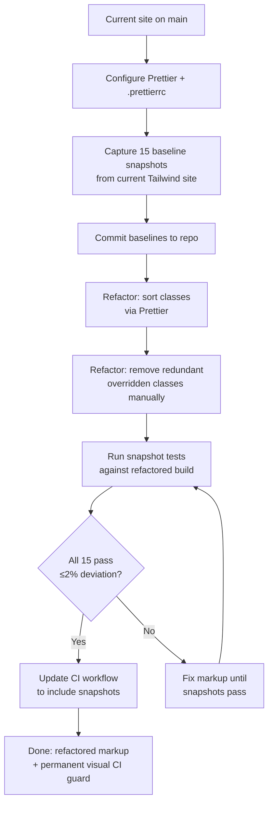

# Plan: Tailwind Visual Regression Testing & Class Cleanup

## Original Work Order

> I've decided to stick with Tailwind. What I'd like to do is create Playwright tests at three breakpoints (mobile, tablet, and desktop) that will compare a build against screenshots and test whether there's a pixel variance of greater than 2%. With this testing in place, I'd like to then go through and work on refactoring and cleaning up the existing Tailwind classes in use. I'd like to delete or eliminate unused classes, if there are any. For instance those that might not be showing up or that are getting overridden. I'd like to make sure all my classes are alphabetized. We'd do this but then test the new build using Playwright to make sure we haven't deviated from the current design.

## Plan Clarifications

| Question | Answer |
|---|---|
| Viewport widths | Mobile 375px, Tablet 768px, Desktop 1280px |
| Class sorting tool | Prettier with prettier-plugin-tailwindcss (already installed) |
| "Unused" class definition | Visually redundant or overridden classes in HTML markup (not CSS purge — Tailwind v4 handles that automatically) |
| Pages in scope | All 5 pages × 3 viewports = 15 snapshots |
| CI integration | Yes — ongoing check in GitHub Actions; override by updating baselines locally and committing |

## Executive Summary

The Carbondale Bike Project site is stable on Eleventy + Tailwind CSS v4 with Netlify hosting and a working GitHub Actions CI pipeline. This plan adds visual regression protection and cleans up the Tailwind markup — two independent but sequenced concerns that depend on each other in a specific order.

The visual regression suite must be established first, before any markup changes, so that the current rendered output becomes a verified baseline. Only then is it safe to refactor Tailwind classes: sorting them via Prettier and removing visually redundant ones. The snapshot tests then serve as the automated proof that refactoring produced no visible change.

The result is a tighter codebase with alphabetized, non-redundant Tailwind classes and a permanent visual regression guard that runs on every push to `main` — with a clear, low-friction path to intentionally update baselines when visual changes are wanted.

## Context

### Current State vs Target State

| Aspect | Current State | Target State | Why |
|---|---|---|---|
| Visual regression testing | No snapshot tests; only functional Playwright tests | 15 snapshot tests (5 pages × 3 breakpoints) running in CI | Catch accidental visual regressions on every push |
| Tailwind class order | Unordered, hand-written class strings | Alphabetically sorted via Prettier + prettier-plugin-tailwindcss | Consistency, readability, easier diffs |
| Redundant markup classes | Unknown number of conflicting/overridden class combinations | All conflicts resolved; each class on an element has visible effect | Reduce confusion, eliminate dead weight in markup |
| CI pipeline | Runs functional Playwright tests only | Also runs visual snapshot comparison; fails on >2% pixel deviation | Automated design integrity check |
| Snapshot update workflow | N/A | Update locally with `--update-snapshots`, commit PNGs; CI passes | Intentional visual changes are easy and explicit |
| Prettier config | `prettier-plugin-tailwindcss` installed, no `.prettierrc` | `.prettierrc` configured with plugin; `npm run format` script added | Enable automated class sorting across all templates |

### Background

The site has 5 pages and three meaningful layout breakpoints that correspond to Tailwind's `sm` (640px), `md` (768px), and `lg` (1024px+) prefixes. The chosen snapshot viewports — 375px, 768px, 1280px — represent a realistic phone, a tablet, and a typical desktop, covering all three layout tiers.

`prettier-plugin-tailwindcss` is already in `devDependencies` but there is no `.prettierrc` and no format script. It requires a Prettier config to activate the Tailwind class sorting behavior.

Tailwind v4 automatically purges classes not found in scanned templates, so there are no "unused" classes in the compiled CSS output. The cleanup target is the HTML markup itself: class attributes where two utilities set the same CSS property on the same element (e.g. `text-sm text-base` — last one wins, first is dead), or classes whose effect is entirely masked by specificity or a later sibling class.

The existing `ci.yml` GitHub Actions workflow already installs Playwright and runs `npm test`. Snapshot tests will slot directly into this pipeline. The override workflow is simple: run `npx playwright test --update-snapshots` locally, review the diff visually, commit the updated PNGs. The CI will then pass on the next push because the committed PNGs are the new baseline.

External widgets (PayPal campaign card, Google reCAPTCHA badge) render non-deterministically across runs. These regions must be masked in snapshot tests to prevent flaky failures unrelated to CSS changes.

## Architectural Approach

### Prettier Configuration

**Objective**: Enable automated Tailwind class sorting across all HTML templates using the already-installed `prettier-plugin-tailwindcss`.

A `.prettierrc` file is added to the project root declaring `prettier-plugin-tailwindcss` as a plugin. A `format` npm script is added that runs Prettier over all `_includes/`, `_includes/layouts/`, and content page files. The plugin integrates with Tailwind v4's CSS-based config by pointing at `src/stylev3.css` as the stylesheet entry point via Prettier config options.

The format script runs once as part of the refactor — it is not wired into the build or dev server. Formatting is a developer-side operation, not a build step.

### Visual Baseline Capture

**Objective**: Photograph the current site at all 15 viewport/page combinations before any markup changes, establishing an authoritative pixel-level reference.

A new `tests/e2e/snapshots.spec.js` file defines tests for all 5 pages at all 3 viewports. Each test navigates to the page, waits for network idle, masks the PayPal and reCAPTCHA regions, then asserts `toHaveScreenshot()` with `fullPage: true` and `maxDiffPixelRatio: 0.02`. The 15 generated PNG files are committed to `tests/e2e/__snapshots__/`.

Baselines are always captured against the live dev server (`npm run dev`) to ensure PostCSS-compiled CSS is in effect. The `playwright.config.js` already configures `webServer` to start the dev server before tests, so no config changes are needed to run snapshot tests locally.

The 15 PNG files are committed to `main` before any refactor work begins. They become the immutable reference for the refactor phase.

### Tailwind Class Refactor

**Objective**: Produce clean, sorted, non-redundant Tailwind class strings across all templates without changing visual output.

**Sorting pass**: Run the Prettier format script across all templates. This is fully automated and safe — Prettier only reorders classes, never adds or removes them. The sorted output is committed as its own isolated commit before manual cleanup begins, so the two types of changes (order vs. removal) are separated in git history and easier to review.

**Redundancy pass**: Manually audit class strings for conflicts where two classes target the same CSS property on the same element. Common patterns to check:
- Conflicting text size utilities (`text-sm text-base`)
- Conflicting color utilities on the same property (`text-gray-700 text-gray-900`)
- Padding/margin pairs where a later responsive variant completely overrides a base value in all breakpoints
- Classes whose effect is zeroed by an adjacent class (e.g. `hidden block`)

Because Tailwind v4 uses cascade layers and last-class-wins within the same utility group, identifying conflicts requires reading class strings in context. There is no fully automated tool for this; the audit is a careful manual pass per template file.

Dynamically added classes in JavaScript (e.g. the contact form validation classes added via `classList.add()` in `30-contact.html`) are in scope for the sort pass only — they are not in HTML attributes and Prettier does not touch inline JS strings. These class names must be preserved as-is.

### CI Integration

**Objective**: Make snapshot tests a permanent gate on `main` that fails the build if visual output deviates by more than 2%.

The existing `ci.yml` already runs `npm test` after building the site. Once `snapshots.spec.js` exists and baseline PNGs are committed, snapshot tests run automatically in CI with no workflow changes required.

The override path for intentional visual changes:
1. Make the visual change locally
2. Run `npx playwright test tests/e2e/snapshots.spec.js --update-snapshots`
3. Review the updated PNGs visually to confirm they match intent
4. Commit the updated PNG files alongside the code change
5. Push — CI passes because committed PNGs are the new baseline

This approach keeps the override explicit (a deliberate commit of new PNGs) and traceable in git history. There is no flag or environment variable that silently bypasses the check.

## Risk Considerations and Mitigation Strategies

Technical Risks

- **Flaky snapshots from external widgets**: PayPal campaign card and reCAPTCHA badge load asynchronously and may render inconsistently between runs.
  - **Mitigation**: Mask these regions in every snapshot test using Playwright's `mask` option targeting their DOM locators.

- **Font rendering differences between macOS and Linux (CI)**: System font rendering differs between the development machine (macOS) and GitHub Actions (Ubuntu), which can push pixel deviation above 2% even for identical markup.
  - **Mitigation**: Generate and commit baselines on the same OS as CI (Ubuntu via GitHub Actions `--update-snapshots` run), or adjust `maxDiffPixelRatio` to account for cross-platform variance. Baselines committed from macOS must be re-generated on Linux if CI failures occur.

- **Prettier not recognizing Tailwind v4 CSS entry point**: `prettier-plugin-tailwindcss` may need explicit config to find `src/stylev3.css` instead of a `tailwind.config.js`.
  - **Mitigation**: Set `"tailwindStylesheet": "./src/stylev3.css"` in `.prettierrc`. Verify class sort output on a single file before running across all templates.

Implementation Risks

- **Redundancy audit misses a conflict**: A manually overlooked redundant class gets removed and causes a subtle visual change that the 2% threshold doesn't catch.
  - **Mitigation**: Commit the sorting pass and redundancy pass as separate commits. Run the full 15-snapshot suite after each commit, not just at the end.

- **JS-managed class names removed during audit**: Dynamically toggled classes (validation states in `30-contact.html`) look "unused" in HTML but are added at runtime.
  - **Mitigation**: Before the redundancy pass, grep for class names used in `classList.add/remove` calls and maintain a do-not-remove list. Verify contact form validation visually after refactor.

## Success Criteria

### Primary Success Criteria
1. 15 Playwright snapshot tests exist covering all 5 pages at 375px, 768px, and 1280px widths, with baseline PNGs committed to the repo
2. `npm test` passes locally and in GitHub Actions CI including all snapshot comparisons
3. All Tailwind class strings across all templates are sorted by `prettier-plugin-tailwindcss` and no redundant/conflicting class pairs remain
4. The refactored build produces ≤2% pixel deviation from the pre-refactor baselines across all 15 snapshots
5. The path to intentionally update baselines is documented and requires a deliberate commit of updated PNGs

## Documentation

- Update `CLAUDE.md`: add snapshot update instructions to the Feature Branch Workflow section; document the `.prettierrc` config and `npm run format` script
- Add a brief comment to `tests/e2e/snapshots.spec.js` explaining the override workflow for future contributors

## Resource Requirements

### Development Skills
- Playwright visual testing (`toHaveScreenshot`, `mask`, `--update-snapshots`)
- Prettier configuration with `prettier-plugin-tailwindcss`
- Tailwind CSS utility class knowledge sufficient to identify conflicting utilities

### Technical Infrastructure
- `prettier-plugin-tailwindcss` (already in devDependencies)
- `@playwright/test` (already in devDependencies, Chromium already installed in CI)
- GitHub Actions CI (already configured in `.github/workflows/ci.yml`)
